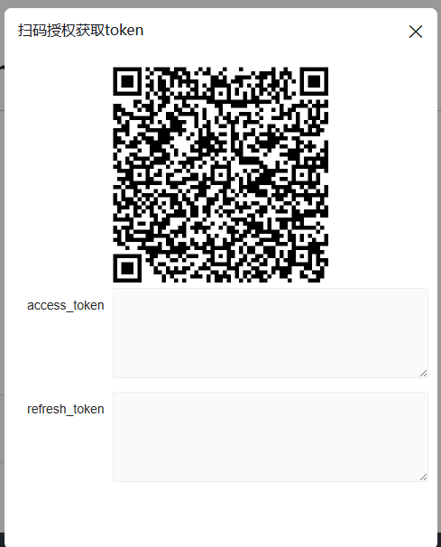
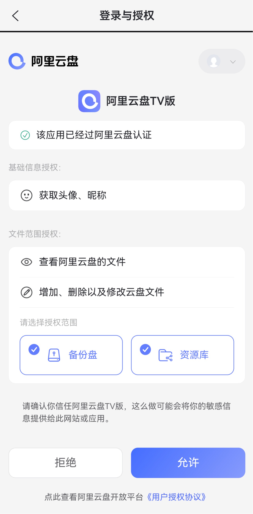
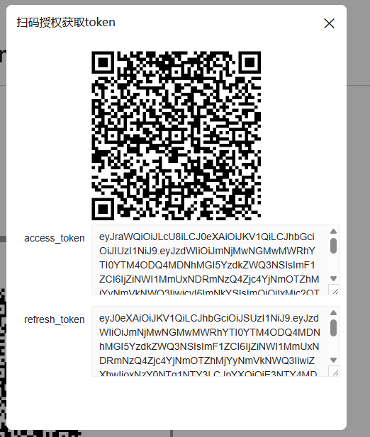
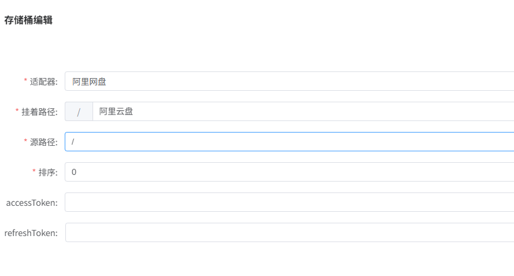

## 获取accessToken

---

import Modal  from '@site/src/components/Modal';

### 阿里云盘授权token

1、点击按钮获取授权二维码

<Modal text="点击获取" title="扫码授权获取token" iframeUrl="/NexuMount-docs/html/views/drivers/aliyun/getToken.html" width="480px" height="600px" />

访问托管在Cloudflare，国内用户可能加载较慢！

2、使用阿里网盘扫码获取token

3、授权成功后自动出现 `access_token` 和 `refresh_token`

4、复制对于内容到后台配置

