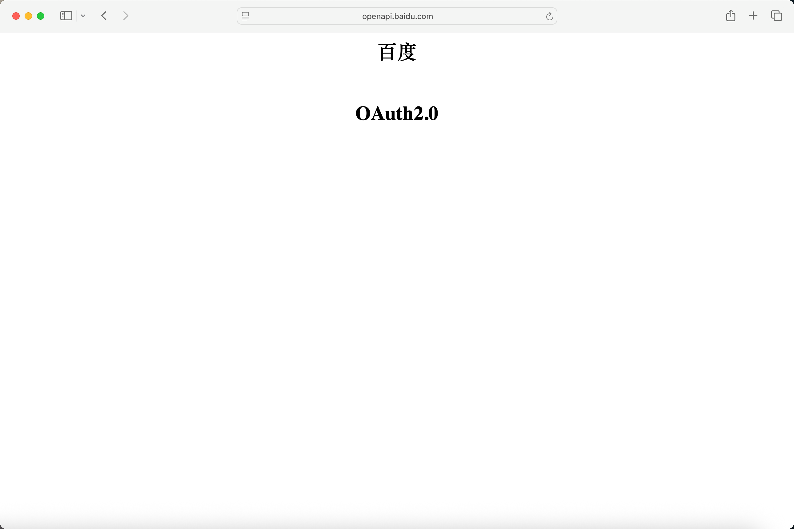
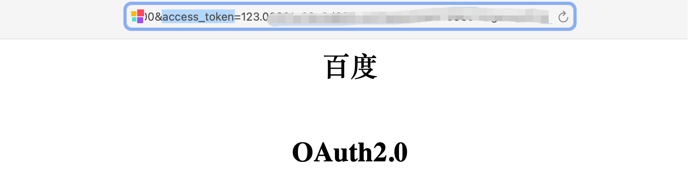

## 获取accessToken

---
百度网盘授权token

1、确保当前当前浏览器已登录百度网盘。

2、当前浏览器未安装网盘助手类油猴插件。

3、通过第三方获取 [点击授权Token](https://openapi.baidu.com/oauth/2.0/authorize?client_id=IlLqBbU3GjQ0t46TRwFateTprHWl39zF&response_type=token&redirect_uri=oob&confirm_login=0&scope=basic,netdisk)。

4、页面会自动跳转到如下页面

5、从当前页面地址中获取

import Modal  from '@site/src/components/Modal';

<Modal text="打开弹框" title="获取token" iframeUrl="/NexuMount-docs/html/views/drivers/baidu/getToken.html" width="900px" height="600px" />

## 源路径

---
根路径直接输入 `/` ，不是根路径按照文件夹层级 `/备份/122222`
