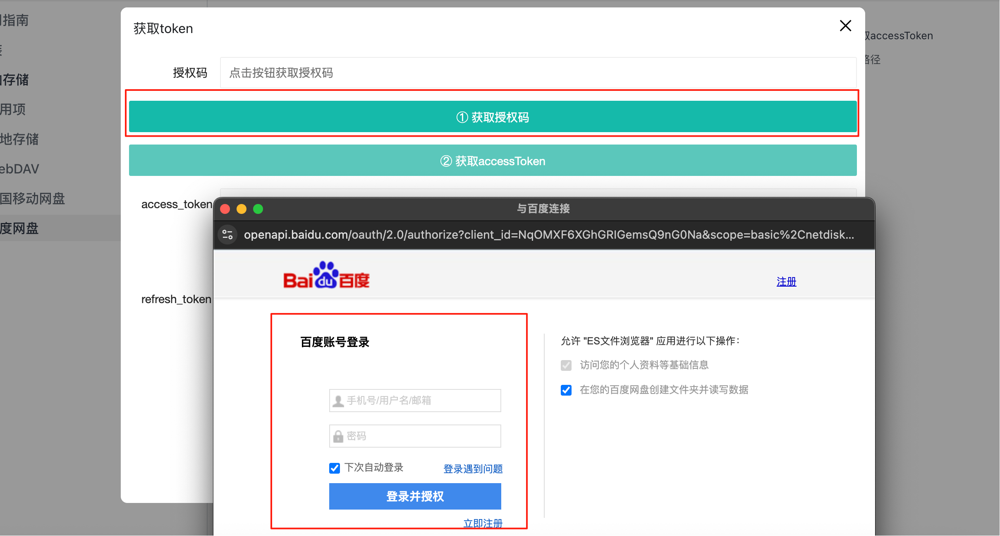
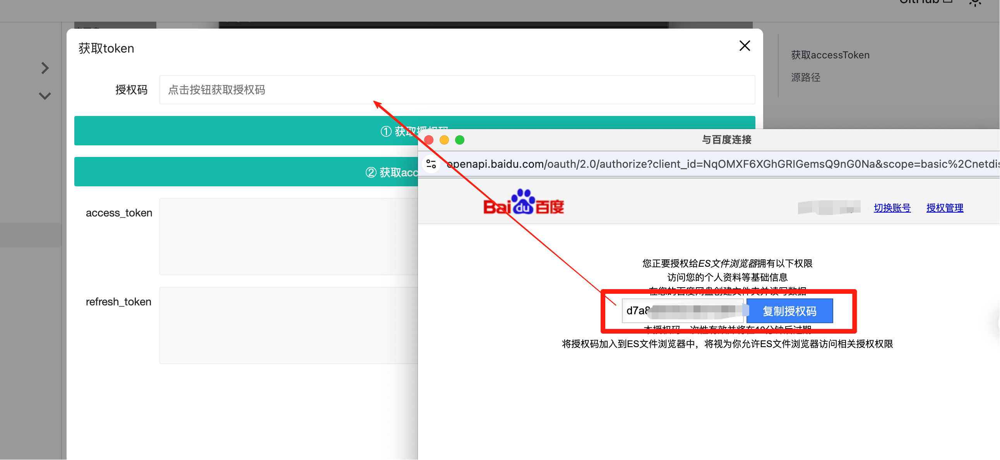
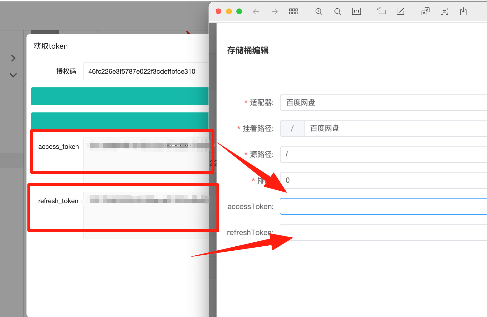

## 获取accessToken

---

### 百度网盘授权token

1、确保当前当前浏览器已登录百度网盘。

2、当前浏览器未安装网盘助手类油猴插件。

3、获取授权码

- 点击获取授权码
- 弹框中登录百度账号并授权

import Modal  from '@site/src/components/Modal';

<Modal text="点击获取" title="获取token" iframeUrl="/NexuMount-docs/html/views/drivers/baidu/getToken.html" width="900px" height="600px" />

- 复制授权到到文本框内

- 点击获取获取accessToken

4、设置 access_token 和 refresh_token

## 源路径

---
根路径直接输入 `/` ，不是根路径按照文件夹层级 `/备份/122222`
