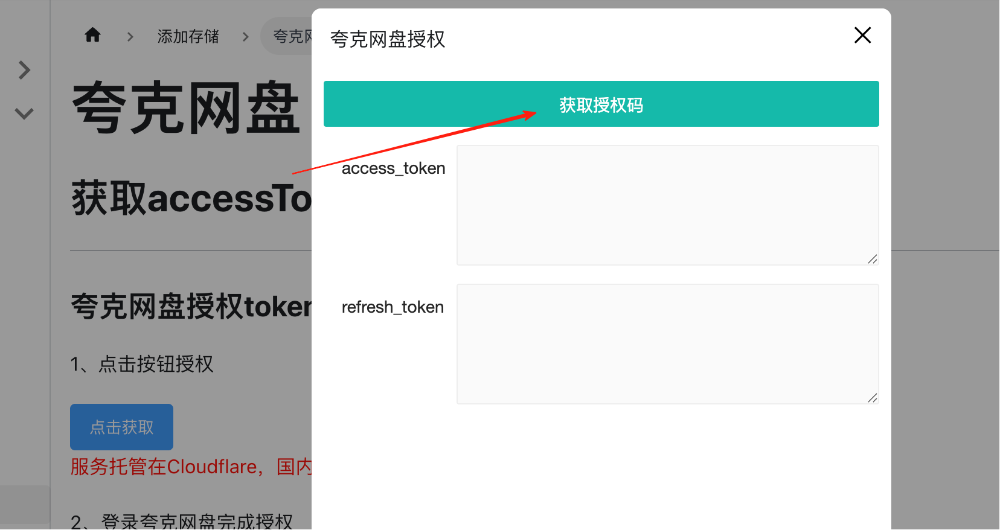
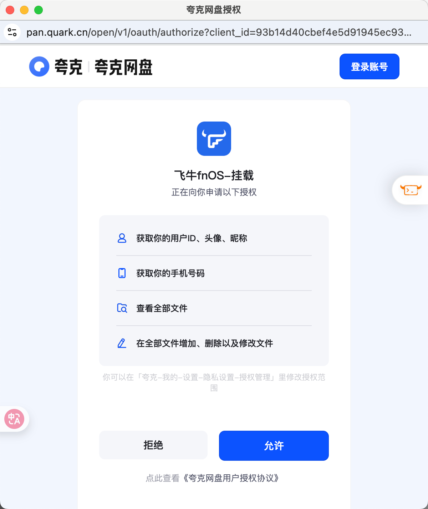
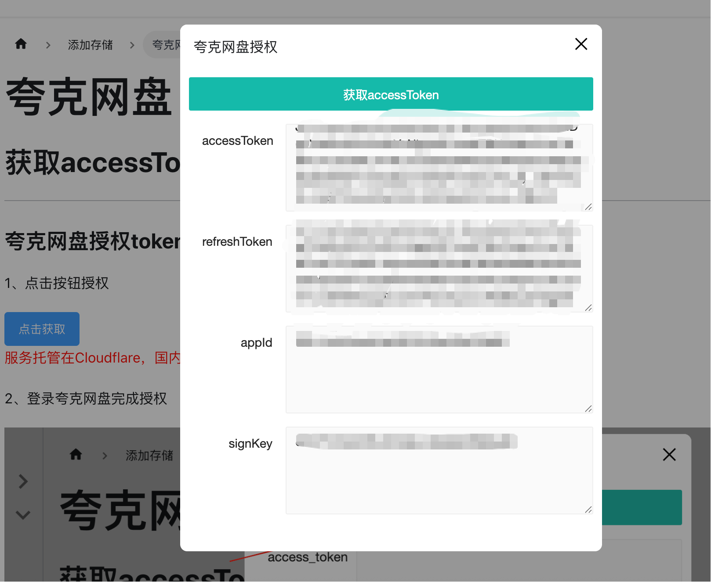
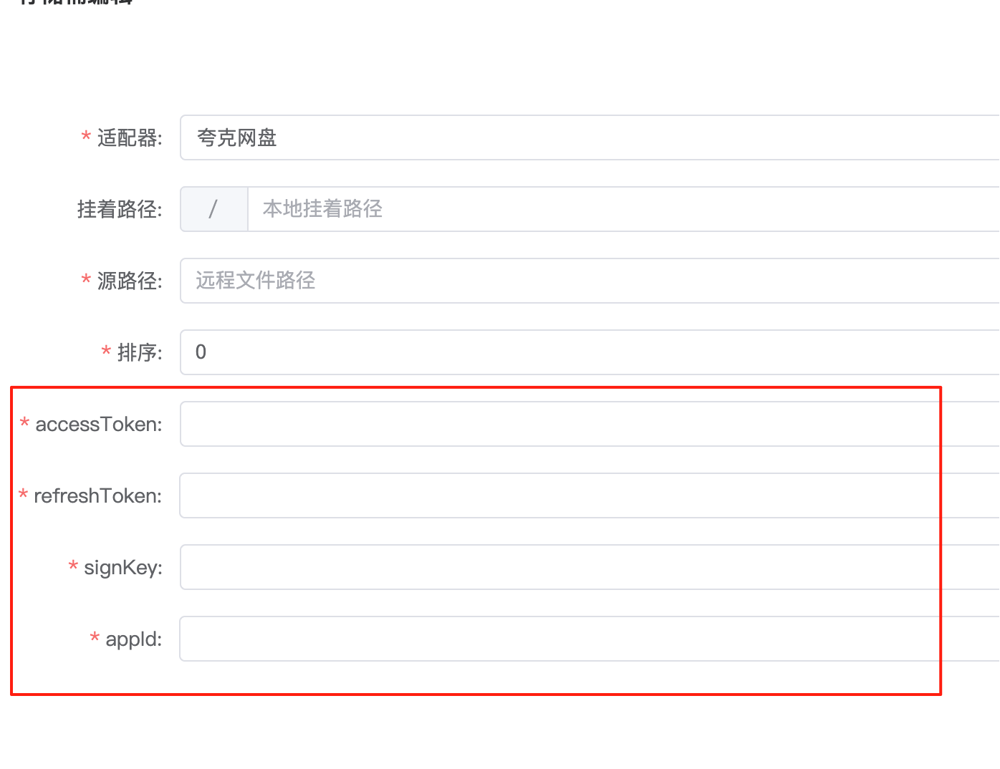

## 获取accessToken

---

import Modal  from '@site/src/components/Modal';

### 夸克网盘授权token

1、点击按钮授权

<Modal text="点击获取" title="夸克网盘授权" iframeUrl="/NexuMount-docs/html/views/drivers/quark/getToken.html" width="480px" height="600px" />

服务托管在Cloudflare，国内用户可能加载较慢！

2、登录夸克网盘完成授权

3、授权成功后自动出现 `access_token` 和 `refresh_token`

4、复制对于内容到后台配置

