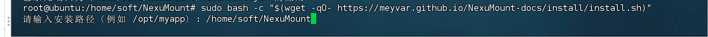
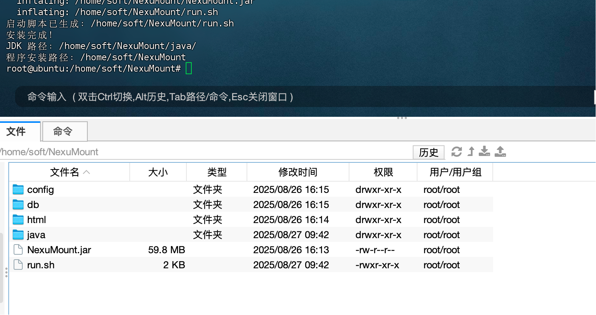
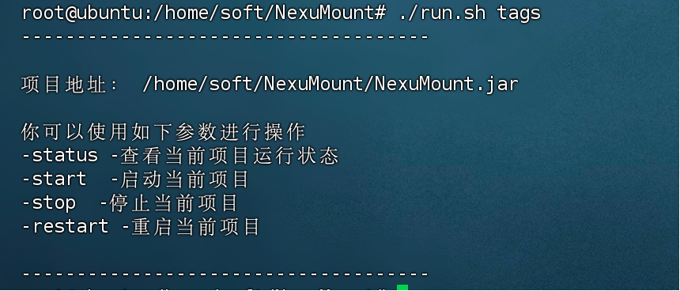

## Linux

amd64/arm64 平台。

使用管理员账号执行一下命令，或执行时输入管理员账号

```bash
sudo bash -c "$(wget -qO- https://meyvar.github.io/NexuMount-docs/install/install.sh)"
```



输入安装路径后开始自动安装，等待安装完成出现如下内容



使用 `cd` 命令进入安装目录

``cd 安装时输入的路径``

在安装路径下执行 ``./run.sh tags`` 查看命令提示


- 启动：         ./run.sh start
- 停止：         ./run.sh stop
- 重启：         ./run.sh restart
- 查看：        ./run.sh.status
